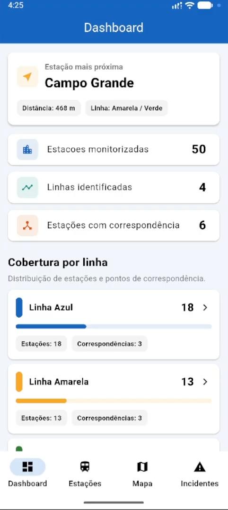
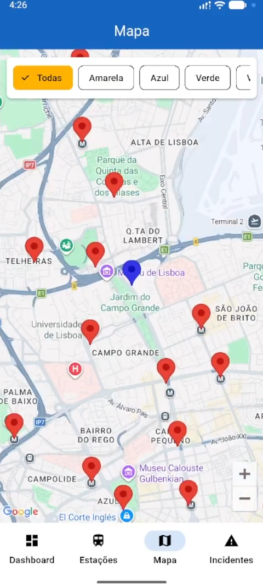
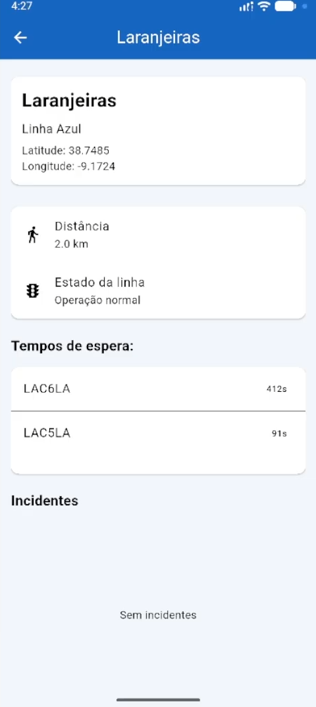
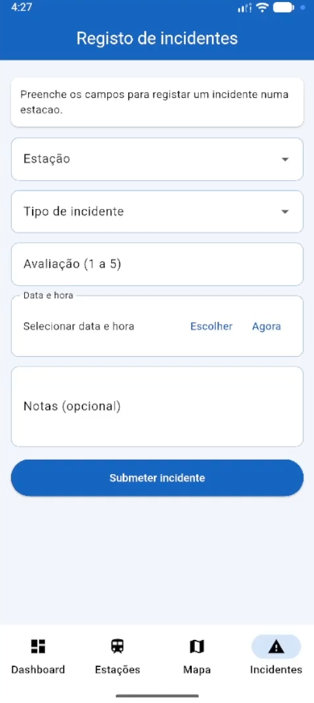

# App Metro de Lisboa - Parte 2

**Universidade Lusófona de Humanidades e Tecnologias**  
Computação Móvel – 2025/26  

## Elementos do Grupo
- Rodrigo Santos – 22306575  
- Pedro Fonseca – 22304461  

---

## Screenshots dos Ecrãs

### Dashboard

### Lista de Estações

### Mapa

### Detalhe da Estação

### Incidentes

---

## Funcionalidades Implementadas

Com base na grelha de avaliação fornecida, foram implementadas as seguintes funcionalidades da parte 1 e da parte 2:

- Dashboard com resumo da rede, número de estações, linhas identificadas, estações com correspondência e estação mais próxima do utilizador.
- Apresentação das estações em lista, com dados carregados a partir da API do Metro de Lisboa.
- Pesquisa de estações por nome.
- Filtro de estações por linha.
- Apresentação das estações no mapa, usando Google Maps e markers.
- Navegação entre dashboard, lista, mapa, formulário de incidentes e detalhe da estação.
- Ecrã de detalhe da estação com nome, linha, coordenadas, estado, distância ao utilizador, tempos de espera e incidentes.
- Cálculo da distância entre a localização atual do utilizador e a estação.
- Apresentação dos tempos de espera vindos da API do Metro de Lisboa.
- Registo de incidentes através de formulário.
- Persistência dos incidentes numa base de dados local usando Sqflite.
- Apresentação dos incidentes guardados no detalhe da estação.
- Geolocalização usada no dashboard, no mapa e no detalhe da estação.
- Funcionamento offline com dados guardados localmente.
- Injeção de dependências com Provider.
- Separação da lógica de dados através do padrão repositório.
- Testes automáticos adicionais dentro da pasta `student`.

---

## Arquitetura da Aplicação

A aplicação foi organizada de forma a separar a interface gráfica da lógica de dados.

Os ecrãs da aplicação encontram-se na pasta `lib/screens`, os modelos na pasta `lib/models` e a camada de dados na pasta `lib/data`.

Foi usado o Provider para injetar dependências como o `MetroRepository`, a fonte de dados HTTP, a fonte de dados local Sqflite, o serviço de localização e o módulo de conectividade.

A aplicação usa o padrão repositório através da classe `MetroRepository`. Desta forma, os ecrãs não precisam de saber diretamente se os dados vêm da API ou da base de dados local. Isto torna a aplicação mais organizada e facilita o funcionamento offline.

Quando existe ligação à internet, a aplicação carrega as estações a partir da API do Metro de Lisboa e guarda esses dados localmente com Sqflite. Quando não existe ligação, a aplicação usa os dados previamente guardados e mostra uma mensagem ao utilizador a indicar que está a usar dados locais.

Os incidentes registados pelo utilizador também são guardados localmente, permitindo que sejam apresentados posteriormente no detalhe da estação.

---

## Autoavaliação

Consideramos que o trabalho cumpre os principais requisitos pedidos no enunciado da parte 2.

Estimamos uma classificação de **17 valores**, uma vez que foram implementadas todas as funcionalidades obrigatórias e várias funcionalidades adicionais, como tempos de espera, distância, geolocalização em vários ecrãs, funcionamento offline e testes adicionais.

---

## Vídeo de Apresentação

Link para o vídeo de apresentação publicado no YouTube como unlisted:

https://youtu.be/0Ncw6nqk4sc
